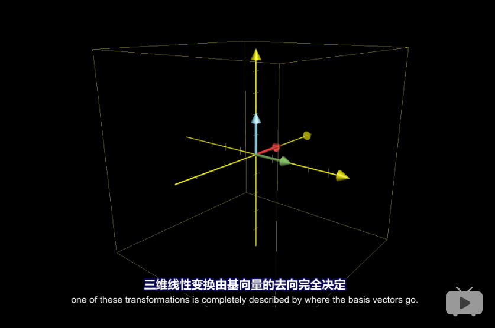

## 矩阵的行与列哪个是基向量？

$$A \hat{v} =
\begin{bmatrix}
1   & 3 \\
-2  & 0
\end{bmatrix}
\begin{bmatrix}
x \\
y
\end{bmatrix}
=
x
\begin{bmatrix}
1 \\
-2
\end{bmatrix}
+
y
\begin{bmatrix}
3 \\
0
\end{bmatrix}
$$

**上面表示矩阵的每一列是一个基向量**。

同时，上面右侧的向量表示向量 $\hat{v}=(x,y)$ 在矩阵 $A$ 表示的基中的坐标。

## 每个非奇异矩阵都代表一个基

$$
\begin{bmatrix}
1  & 1 \\
0  & 1
\end{bmatrix}
\begin{bmatrix}
0  & -1 \\
1  & 0
\end{bmatrix}
\begin{bmatrix}
x \\
y
\end{bmatrix}
=
\begin{bmatrix}
1  & -1 \\
1  & 0
\end{bmatrix}
\begin{bmatrix}
x \\
y
\end{bmatrix}
$$

$$
\begin{bmatrix}
1  & 1 \\
0  & 1
\end{bmatrix}
$$

就表示将**行单位向量**变为 $(1, 0)$，**列单位向量**变为 $(1, 1)$ 的一个变换，也叫做剪切变换。也就是**基向量的去向决定了一个线性变换**。

## 矩阵的结合性证明

$$A(BC)=(AB)C$$

因为对一个向量施加联串的变换，是`left to right`作用的，那么 $(AB)C \hat{v}$ 就等于先对向量施加 $C$ 变换，然后施加 $B$ 变换，然后 $A$ 变换。和 $ABC$ 是一样的。
